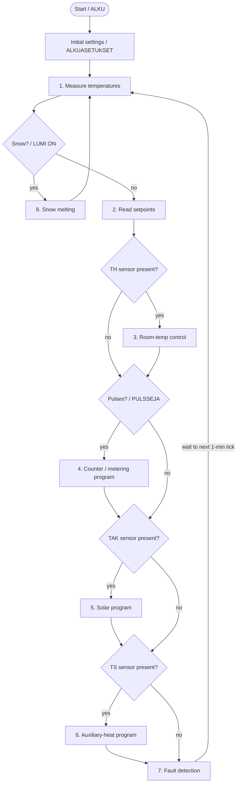
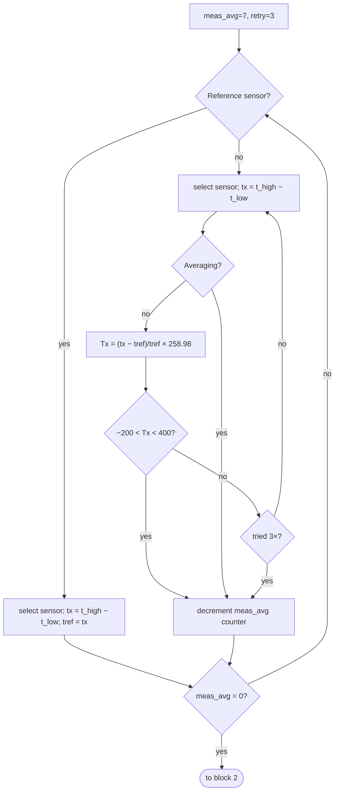
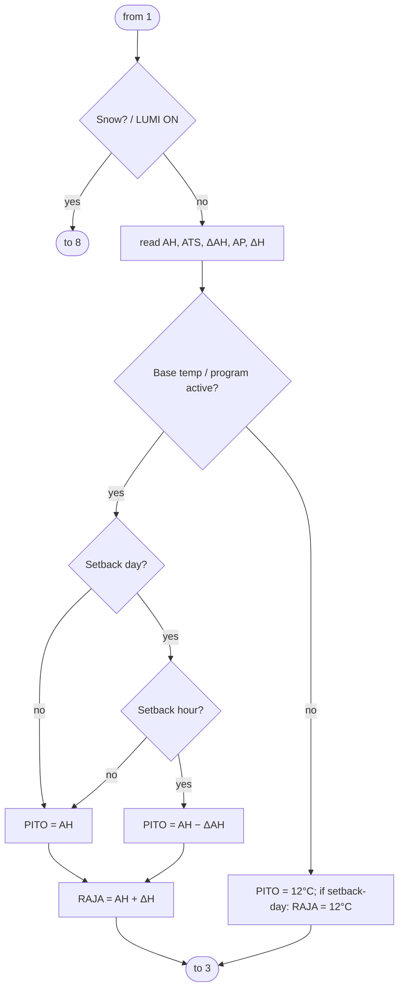
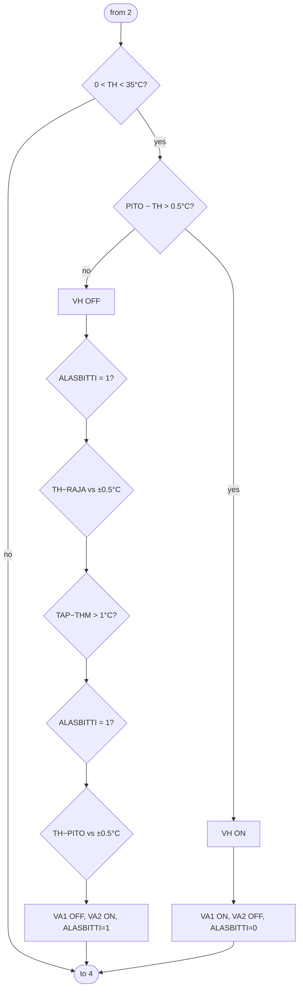
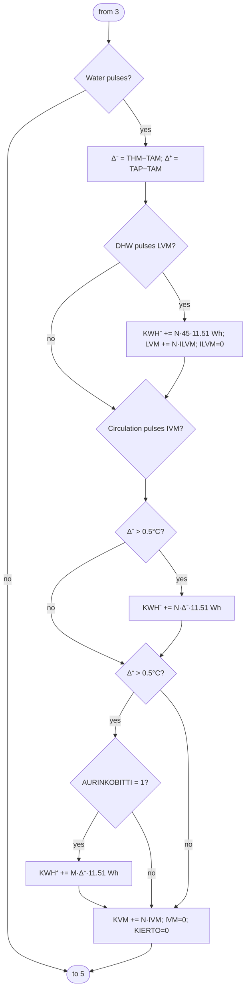
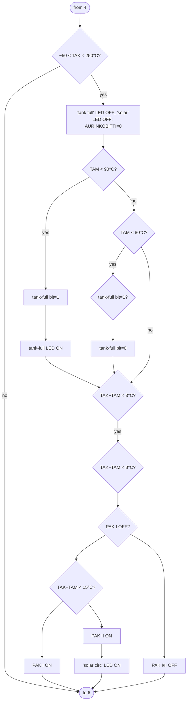
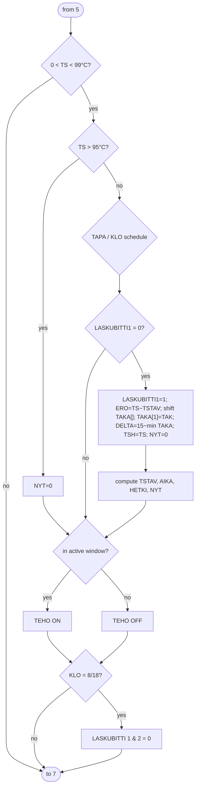
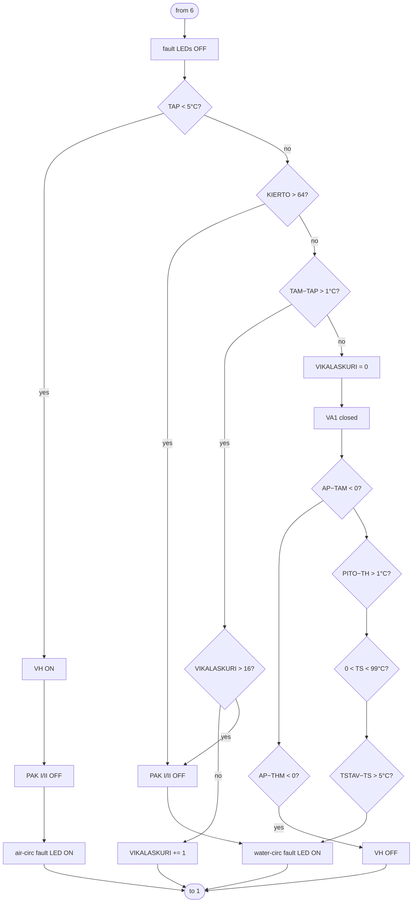
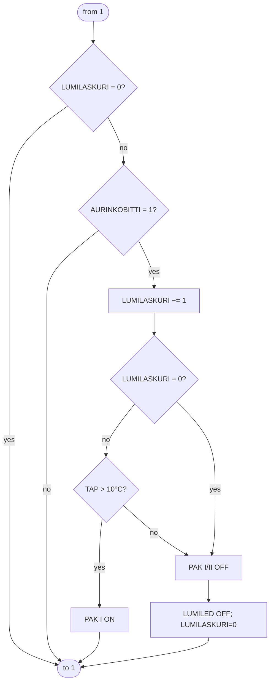

# Kotilämpö firmware flowcharts (English)

English transcription/translation of `Kotilämpö_vuokaaviot.pdf` — the original
Valmet engineering flowcharts, hand-drawn **21.2.1980** (author initials "MH"),
plus the external wiring diagrams (`KUVA 6`, `KUVA 11`). The PDF is a scan with no
embedded text, so this is a manual transcription. Finnish terms that were unclear
in the handwriting are marked `(?)`.

These charts describe the **same program** recovered in
[`../disasm/koti_lampo.c`](../disasm/koti_lampo.c) and corroborate the
reverse-engineering. The main loop's eight numbered blocks map directly onto the
firmware's subroutines.

## Glossary (LYHENTEET — abbreviations, from KUVA 11)

### Sensors (temperature unless noted)
| Code | Finnish | English |
| --- | --- | --- |
| `TH` | huoneenlämmön anturi | Room temperature sensor |
| `TAK` | aurinkokeräjän anturi | Solar collector sensor |
| `THM` | lämmityksen menoveden anturi | Heating **supply** water sensor |
| `TAM` | aurinkolämmönvaihtimen menoveden anturi | Solar heat-exchanger **supply** water sensor |
| `TAP` | paluuveden anturi | **Return** water sensor |
| `TS` | varaajasäiliön anturi | Storage-tank sensor |
| `VM` | lämmityksen kiertoveden määrän anturi | Heating circulation **flow** sensor |
| `LVM` | lämpimän käyttöveden anturi | Domestic hot-water **flow** sensor |

### Actuators / outputs
| Code | Finnish | English |
| --- | --- | --- |
| `VA1`, `VA2` | magneettiventtiilejä | Solenoid valves |
| `VH` | (kolmitieventtiili) | 3-way mixing valve |
| `VP` | kiertovesipumppu | Circulation water pump |
| `PM1`, `PM2` | peltimoottorit | Damper motors |
| `PK` | pääkytkin | Main switch |
| `VPK` | vesipumpun kytkin | Water-pump contactor |
| `PAK` (I / II) | aurinkopuhaltimen kytkin | Solar-fan contactor (2 speeds/stages) |
| `AE` | aurinkoenergia | Solar energy (pulse output) |
| `LE` | kulutettu energia / pulssit kaukonäyttöön | Consumed energy / pulses to remote display |

### Setpoints, variables & state bits (from the flowcharts)
| Code | Meaning |
| --- | --- |
| `AH` | Base room setpoint (peruslämpö), e.g. 20°C |
| `ΔAH` | Setback delta (alennus) |
| `ΔH` | Rise / overshoot allowance (nousu) |
| `PITO` | Current "hold" / target value |
| `RAJA` | Upper limit (= AH + ΔH) |
| `ATS` | Tank max (säiliön maksimi) |
| `AP` | Return-water max (paluuveden maksimi) |
| `TSTAV` | Computed target tank temperature |
| `TAPA` | Operating mode 1/2/3/4 |
| `KLO` / `HETKI` | Clock hour / time-of-event |
| `NYT` | "Now" countdown/timer |
| `ALASBITTI` | "Down" hysteresis bit (heating) |
| `AURINKOBITTI` | Solar-active bit |
| `LASKUBITTI 1/2` | Counter/calc state bits |
| `VIKALASKURI` | Fault counter |
| `LUMILASKURI` | Snow-melt counter |
| `KIERTO` | Circulation pulse count |
| `KWH⁻ / KWH⁺` | Consumed / solar energy accumulators |

## System wiring overview (KUVA 6 & KUVA 11)

`KUVA 6` ("Aurinkokoneen ulkoinen johdotus" — solar unit external wiring) shows the
field layout: **KERÄÄJÄ** (solar collector, sensor `TAK`) → **AURINKOPUHALLIN**
(solar fan) + **AURINKOVAIHTOPELTI** (solar exchange damper) → **VARAAJA** (storage
tank, sensor `TS`) and **Lisälämpö** (auxiliary heat) → **KOTILÄMPÖKONE** (the
controller, sensor `TH`) → **AURINKOKONE** (solar machine, with `VIRTALÄHDEYKS.` =
power-supply unit). Cabling: `PFSK 4×0.22` (sensor) and `MMJ 3×1.5` (power/relay).
Mains feed **1~ 220 V, 10 A**. Note: *"Suojaputki Ø50, kaapelin toimittaa Valmet
Oy, max 7 m"* — Valmet-supplied cable in a Ø50 conduit, **7 m max** (this is the
umbilical that terminates in the DB25).

`KUVA 11` is the full electrical schematic and — critically — **shows the 25-pin
D-sub connector** (the DB25 from [`db25_replacement.md`](db25_replacement.md)) in
the centre, fanning the sensor cluster (`THM TAM TAP` / `TS TAK TH` / `VM LVM`) and
the actuator side (`PAK`, `VPK`, `PK` contactors; `VA1`/`VA2` solenoids; `PM1`/`PM2`
damper motors; `VP`) across the connector to the controller. A `T 6.3 A hidas`
(slow-blow fuse) and a transformer (`muuntaja`) sit on the mains side. This legend
is the key to filling in the DB25 pinout table: every wire on the connector is one
of the coded sensor/actuator lines above.

> Cross-check for Route B (ESP32 replacement): the controller's entire physical
> world is the sensor set {TH, TAK, THM, TAM, TAP, TS, VM, LVM} as inputs and the
> actuator set {VA1, VA2, VH, VP, PM1, PM2, PAK I/II, VPK} + the AE/LE pulse
> outputs. Reproduce those and the eight program blocks below and the head unit is
> fully replaced.

## Program structure (KUVA 8 — OHJELMAKAAVIO / main loop)

Runs `ALKUASETUKSET` (init) once, then loops every **1 minute**:



## 1. Measure temperatures (KUVA 9.1 — LÄMPÖTILOJEN MITTAUS)

Measurement averaging counter = 7, retry counter = 3. For each channel: pick the
**reference** sensor first (`tref = tx`), then each other sensor computes a
temperature from the ratio against the reference:

```
Tx = (tx − tref) / tref × 258.98      (258.98 ≈ 1/α for the sensor, i.e. an
                                         RTD-style linearisation around 0°C)
```

Validity gate: **−200°C < Tx < 400°C**; if out of range, retry up to **three**
times, then decrement the averaging counter. Loop until the averaging counter = 0.



## 2. Read setpoints (KUVA 9.2 — ASETTELUARVOJEN LUKU)

If snow present → jump to block 8. Otherwise read: base temp `AH`, tank max `ATS`,
setback `ΔAH`, return-water max `AP`, rise `ΔH`. Then derive the working hold value
`PITO` and the upper limit `RAJA`:



## 3. Room-temperature control (KUVA 9.3 — HUONEENLÄMMÖN OHJAUS)

Sanity gate `0 < TH < 35°C`. Drives the 3-way valve `VH` and solenoid valves
`VA1`/`VA2` with ±0.5°C hysteresis around `PITO`/`RAJA`, using `ALASBITTI` as the
direction/hysteresis memory bit.

- If `PITO − TH > 0.5°C` → heat demand → `VH ON`.
- Otherwise `VH OFF`, then hysteresis comparisons (`TH−RAJA`, `TAP−THM`, `TH−PITO`)
  with the `ALASBITTI` branch decide valve state:
  - **`VA1 ON, VA2 OFF, ALASBITTI=0`** (open / heat up), or
  - **`VA1 OFF, VA2 ON, ALASBITTI=1`** (close / coast down).



## 4. Counter / metering program (KUVA 9.4 — LASKURIOHJELMA)

Energy + water metering from flow pulses. `Δ⁻ = THM − TAM`, `Δ⁺ = TAP − TAM`.
Each pulse adds a fixed energy quantum (≈ **11.51 Wh** per pulse-unit):

- **Domestic hot water** (`LVM` pulses): `KWH⁻ += N·45·11.51 Wh`; `LVM += N·ILVM`.
- **Consumed heating energy** (`VM`/circulation pulses, when `Δ⁻ > 0.5°C`):
  `KWH⁻ += N·Δ⁻·11.51 Wh`.
- **Solar energy** (when `Δ⁺ > 0.5°C` and `AURINKOBITTI = 1`):
  `KWH⁺ += M·Δ⁺·11.51 Wh`.
- Then accumulate circulation count `KVM += N·IVM`; reset `IVM=0`, `KIERTO=0`.



## 5. Solar program (KUVA 9.5 — AURINKO-OHJELMA)

Sanity gate `−50°C < TAK < 250°C`. Manages the "tank full" and "solar" LEDs, the
`AURINKOBITTI`, and the two-stage solar fan contactor `PAK I`/`PAK II` based on the
collector-to-exchanger difference `TAK − TAM`:

- `TAM < 90°C` (and hysteresis at `TAM < 80°C`) sets/clears the **tank-full** bit +
  LED.
- `TAK − TAM` thresholds (`< 3°C` / `< 8°C` / `< 15°C`) select **PAK I/II OFF**,
  **PAK I ON**, or **PAK II ON**, and light the **"solar circulation"** LED.



## 6. Auxiliary-heat program (KUVA 9.6 — LISÄLÄMPÖOHJELMA)

The most complex block: schedules the auxiliary heater (`TEHO ON/OFF`) by operating
**mode** (`TAPA 1..4`) and **clock** (`KLO`/`HETKI`), with a predictive timer `NYT`
and a learning step that records the last tank-temperature slope.

Key relations transcribed from the chart:
```
gate:   0 < TS < 99°C ;  high-cutoff TS > 95°C → NYT=0
learn:  ERO = TS − TSTAV ;  TAKA(n+1)=TAKA(n) (n=1..7) ;  TAKA(1)=TAK
        VANHA = T_TSTAV ;  DELTA = 15 − min(TAKA) ;  TSH = TS ;  NYT=0
target: TSTAV = 1.35·(20 + (DELTA/40)·(ATS−20))      [mode-dependent variant:]
        TSTAV = 20 + (DELTA/40)·(ATS−20)
timing: AIKA = 12 × DELTA × (1 − ERO/VANHA)
        if AIKA > 450 and TAPA=2:  HETKI = 6:30 − AIKA/60   else 5:30 − AIKA/60
        else HETKI = 23 (or 22)
        NYT = AIKA · (1 − VERO/VANHA) ;  VERO = TS − TSH
sched:  TEHO ON when within the active window (e.g. 06<KLO<22 / 07<KLO<23
        depending on TAPA), else TEHO OFF ;  at KLO=8/18: LASKUBITTI 1&2 = 0
```



> Note: block 6 is the firmware's heaviest user of the **packed-BCD math library**
> in bank 1 (`A98EH`) — the multiply/divide in `TSTAV`, `AIKA`, `NYT` are exactly
> the multi-byte BCD routines recovered in the disassembly.

## 7. Fault detection (KUVA 9.7 — HÄIRIÖTUTKIMUS)

Clears the fault LEDs, then runs plausibility checks and lights either the
**air-circulation fault** (`ILMANKIERRON HÄIRIÖLED`) or **water-circulation fault**
(`VEDENKIERRON HÄIRIÖLED`) LED, debounced by `VIKALASKURI` (trips after > 16).



## 8. Snow melting (KUVA 9.8 — LUMEN SULATUS)

Entered from block 1 when snow is detected. Runs the solar fan (`PAK I`) to melt
snow on the collector, counting down `LUMILASKURI`; stops when warm enough
(`TAP > 10°C`) or the counter expires.



## Appendix: room-temperature example (KUVA, ESIMERKKI)

The first page is a worked example ("ESIMERKKI HUONELÄMMÖN LÄMPÖTILAN MUUTOKSISTA"
— example of room-temperature changes) with `AH=20°C`, `ΔAH=1°C`, `ΔH=2°C`. It
plots room temperature (≈12–23°C) over a day against the `PITO` (hold) and `RAJA`
(limit) bands, with a timing chart of `VA1/VA2`, `VH`, `PAK I/II` underneath —
illustrating the hysteresis behaviour of block 3 and the setback schedule of
block 2. `PÄIVÄ / EI VALITTU` = "day / not selected".
