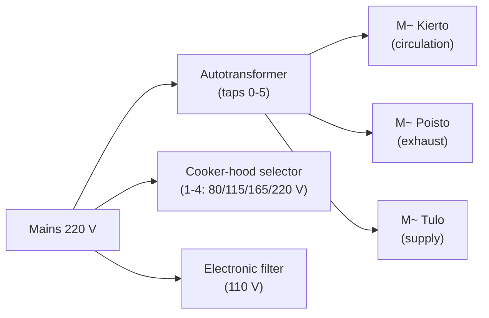

# Wiring diagram (Kotilämpö_sähkökaavio.pdf)

English transcription of the single-page Finnish electrical schematic
`Kotilämpö_sähkökaavio.pdf` (originally `Kotilämpö_schema.pdf`). The drawing
shows the mains wiring of the ventilation motors and the cooker-hood speed
controls. Component values are taken verbatim from the drawing.

## Glossary (Finnish → English)

| Finnish | English |
| --- | --- |
| Säästömuuntaja | Autotransformer (tapped step-down) |
| Kierto | Circulation (recirculation fan) |
| Poisto | Exhaust (extract fan) |
| Tulo | Supply (intake fan) |
| Elektr. suodatin | Electronic (electrostatic) air filter |
| Liesikuvussa sijaitsevat säätimet | Controls located in the cooker hood |
| Kytkentäpiste | Connection / terminal point |
| Sulake | Fuse |
| U/min | rev/min (motor speed) |

## Autotransformer speed taps

The three-phase-style speed control uses a tapped autotransformer
(`säästömuuntaja`). Each tap feeds the motor a different voltage, giving a
fixed set of fan speeds / power levels:

| Tap | Voltage | Motor power |
| --- | --- | --- |
| 0 | 0 V | 0 W (off) |
| 1 | 60 V | 120 W |
| 2 | 90 V | 180 W |
| 3 | 120 V | 240 W |
| 4 | 150 V | 300 W |
| 5 | 220 V | 435 W |

## Cooker-hood selector (`Liesikuvussa sijaitsevat säätimet`)

A separate tap selector mounted in the cooker hood:

| Position | Voltage | Note |
| --- | --- | --- |
| 1 | 80 V | |
| 2 | 115 V | |
| 3 | 165 V | 0.6 A |
| 4 | 220 V | full speed |

## Motors and loads

| Marking | Function | Rating |
| --- | --- | --- |
| M~ Kierto | Circulation fan motor | — |
| M~ Poisto | Exhaust fan motor | — |
| M~ Tulo | Supply fan motor | — |
| Elektr. suodatin | Electrostatic air filter | 110 V |
| Main motor | (largest fan) | 220 V, 2.0 A, 435 W, 1090 rev/min |

Run / phase-shift capacitors shown on the drawing: **2 µF, 4 µF, 10 µF**.
Line protection: **2 A fuses**.

## Symbols

- `⊘` marks a connection point; the adjacent number is the terminal number in
  the transformer junction box.

