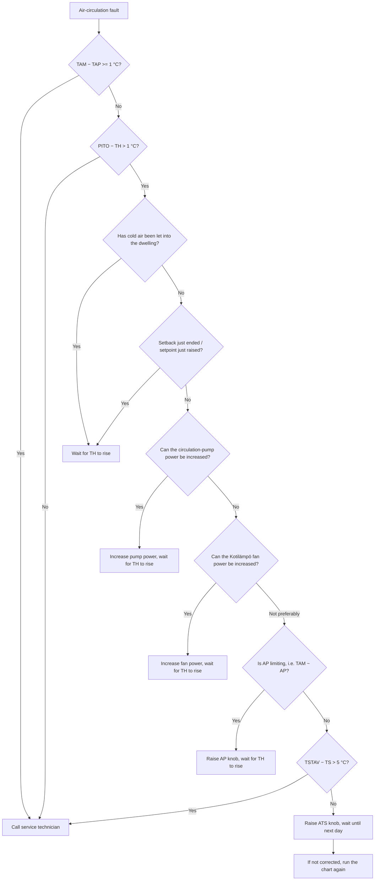
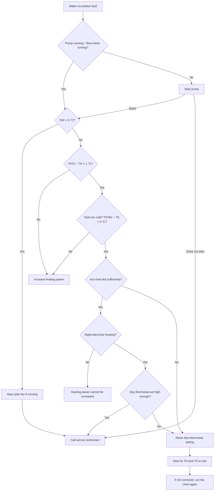

# Function and use (Kotilämpö_toiminta_ja_käyttö.pdf)

English transcription of the Finnish manual
`Kotilämpö_toiminta_ja_käyttö.pdf` (originally
`Kotilämpö_funktion och användning.pdf`). Internal title:
**"AURINKOLÄMMITYSJÄRJESTELMÄN TOIMINTASELOSTUS JA KÄYTTÖOHJEET"**
(Solar-heating system function description and user instructions),
Valmet Oy. This is the companion document to the flowcharts in
[`flowcharts_en.md`](flowcharts_en.md); the variable names and formulas match.

## Glossary (Finnish → English / meaning)

| Symbol | Finnish | English / meaning |
| --- | --- | --- |
| TH | Huonelämpötila | Room temperature (sensor in control centre) |
| TAK | — | Solar-collector temperature |
| THM | — | Heating supply-water temperature |
| TAM | Lämmityksen paluuveden lämpötila (n:o 4) | Heating return-water temperature = solar-exchanger supply |
| TAP | Aurinkolämmönvaihtimen paluuveden lämpötila (n:o 5) | Solar-exchanger return-water temperature |
| TS | Varaajan keskiosan lämpötila (n:o 6) | Storage-tank mid temperature |
| PITO | — | Selected base setpoint, minus the night setback when active |
| TSTAV | Laskettu tavoitearvo | Calculated tank target temperature |
| ATS | — | Tank upper-limit knob value in the control unit |
| AP | — | Return-water upper-limit knob value in the control unit |
| VA1 | Magneettiventtiili | Solenoid valve (Kotilämpö return) — normally open, de-energised |
| VA2 | Magneettiventtiili | Solenoid valve (Kotilämpö bypass) — normally closed, de-energised |
| VH | Kolmitieventtiili | 3-way mixing valve (220 Vac, 20-min time constant) |
| VP | Kiertovesipumppu | Circulation pump |
| PAK | Aurinkopuhallin | Solar fan |
| PM | Peltimoottori | Damper motor (controls dampers at the top of the solar machine) |
| VM / LVM | Vesimittari | Heating / domestic-hot-water flow-meter pulse inputs |
| LL | — | Aux-heat-on LED |
| LE / AE | — | Energy-pulse LEDs (blink per kWh) |

## A. Function description

The system couples a solar collector, a Kotilämpö ventilation/heat unit and a
~3 m³ storage tank under automatic control. Six Pt100 sensors feed an Intel
8035-based control unit; a separate power-supply unit carries the relay/driver
card (AVO-card) for the actuators.

Main components:

- **Control unit** — 8035 microcontroller; reads sensors and setpoint knobs,
  drives the program, runs the display (6-digit value + 1-digit item selector).
- **Power-supply unit** — mains supply plus the AVO output card (relays,
  drivers) for valves, pumps, fans.
- **Sensors** — six Pt100 temperature probes (TH, TAK, THM, TAM, TAP, TS) and
  the VM/LVM flow-meter pulse senders.
- **Valves** — VA1/VA2 solenoid valves (24 Vdc), VH 3-way mixing valve
  (220 Vac).
- **Solar fan (PAK)** — single-phase motor, 3 speeds via a transformer;
  PAK I / PAK II contactor outputs.

### Software — 8-block program (1-minute cycle)

1. **Measure temperatures** — read all Pt100 channels.
2. **Read setpoints** — base setpoint, knobs (ATS, AP), setback state.
3. **Room control** — compute PITO and drive VA1/VA2/VH for the room loop.
4. **Metering** — count VM/LVM pulses, accumulate energy (kWh, LE/AE pulses).
5. **Solar program** — run the collector/exchanger loop (see below).
6. **Aux-heat program** — decide and time supplementary heating (see below).
7. **Fault detection** — water- and air-circulation fault tests.
8. **Snow melt** — own 30-minute cycle.

### Setpoint, PITO and limits

`PITO` is the selected base room temperature reduced by the night setback when
the setback period is active. Changing PITO produces the same effect as the
setback starting/ending. The tank target `TSTAV` is **not shown on the
display**; it is determined from the ATS knob, the chosen control curve, the
selected aux-heat option, and the week's minimum outdoor temperature
(see "Determining TSTAV" below).

### Solar program

The solar exchanger circulates collector heat into the tank. Freezing
protection and over-temperature handling are part of the fault tests
(TAP < 5 °C, TAM−TAP, etc.). Yellow LEDs indicate **solar-circulation active**
and **tank full (> 90 °C)**.

### Aux-heat (supplementary heating) program

Supplementary heating tops up the tank water at night using one of several
options:

- **Option 1** — base option (see control curve graph).
- **Option 2** — target temperature set once per day at 22:00 from the control
  curve; outdoor temperature taken as before. Aux-heat time limited to **8 h
  (22:00–06:00)**. Suits full night-tariff cases: a full 8 h heats the tank
  when the week's minimum is −25 °C or colder. Heating time shortens linearly
  to zero as the week's minimum rises toward +15 °C per the control curve. If
  the target was not reached or was exceeded, a corresponding correction is
  applied to the next night's heating time.
  - If the calculated heating time is shorter than 8 h (week warmer than
    −25 °C), the time is trimmed **from the start (early evening)**, so the
    aux-heat control always ends at a full hour. Any change in tank temperature
    between the calculation moment and the switch-on moment is taken into
    account as a correction. A two-hour reserve is left at the end of the period
    for correction.
- **Option 3** — like option 2 except the permitted heating time is
  **23:00–07:00**.

In all options the calculation and switch-on moments use full hours, so a
momentary fault cannot block correct calculation and control.

Aux-heat is **never switched on if the tank temperature exceeds 95 °C**. On
options 2 and 3 automation gives no aux-heat control outside 22:00–06:00 /
23:00–07:00. "Day electricity" can still be used to heat the tank top via a
thermostat fitted to the tank upper section; this thermostat is also needed to
guarantee a high enough top temperature for domestic hot water outside the
heating season (see control-curve graph, fig. 3).

### Fault detection (§3.2.7)

The fault program raises two possible alarms: **water-circulation fault** and
**air-circulation fault**.

**Water-circulation fault** is raised when:

1. Solar-exchanger return-water temperature is below 5 °C (`TAP < 5 °C`) —
   freezing risk. The tank-top water is then taken into circulation and the
   solar fan is stopped if it was running.
2. No heating-water pulses have arrived within 64 minutes.
3. Room temperature has fallen 1 °C below PITO **and** the tank water is too
   cold (5 °C below the calculated target).

**Air-circulation fault** is raised when:

1. Water cools in the solar exchanger (`TAM−TAP > 1 °C` has persisted over
   16 min). The solar fan is stopped if it was running.
2. Room temperature has fallen 1 °C below PITO even though the tank holds enough
   hot water (not 5 °C below the calculated target).

If no tank sensor is fitted, air-circulation fault case 3 also applies. The
fault program also limits use of tank-top water as described earlier; when the
limit condition is met no alarm is sounded, but the limit may later cause room
temperature to drop, which lights the air-circulation fault LED. A separate
action flowchart covers what to do when a fault LED lights.

## B. Display / use

The display shows a 6-digit value plus a 1-digit item selector. Red LEDs
indicate air- and water-circulation faults; yellow LEDs indicate
solar-circulation active and tank full (> 90 °C).

## Determining TSTAV (calculated tank target)

The troubleshooting flowcharts reference the automation's calculated `TSTAV`,
which is not displayed. Determine it from the ATS knob, the chosen control
curve, the selected aux-heat option, and the week's minimum temperature. Once
deduced, pick test resistors above and below this value and fit them in place
of the TS sensor; the aux-heat control will switch on/off with a couple of
minutes' delay, confirming the value. At commissioning and after every reset,
`TSTAV` should default to **60 °C**, which can be tested with **52 °C and
70 °C** test resistors.

## C. Service instructions (HUOLTO-OHJEET)

Understanding these requires understanding the system function. The service
aids are the **test box** and **test resistors** plus a multimeter (their
instructions are in the appendix). Faults split into those the automation can
flag with a fault LED and those found otherwise.

Faults that do **not** light a fault LED:

1. **Total blackout of the control unit** — likely a broken power feed. Trace
   the supply with the wiring diagrams and aids. If no fault is found, or a
   replaced fuse blows again, replace the AVO-card first, then the
   power-supply unit.
2. **Automation stuck in a fixed state** — first try to recover by switching
   off power at the solar main switch. If that fails, before swapping the
   control unit, reset the automation (this zeroes the consumed-energy and
   solar-energy totals).
3. **Temperature measurement fails** — if all measured temperatures are
   clearly wrong, replace the AVM sensor card in the power-supply unit. If only
   one reading is wrong, check that sensor's wiring and substitute a test
   resistor before replacing the sensor / cards / units. The test box shows
   directly whether a sensor measurement is struggling.
4. **Control unit not acting per the function description** — the test box
   shows whether the outputs match the measured values and selected setpoints.
   If no obvious fault (dark display, bad switch contact), replace the control
   unit.
5. **Control unit gives correct outputs (per the test box)** — remaining
   suspects: the power-supply control card, relays, wiring and the actuators
   themselves. Pump and fan operation is easy to observe. VA1/VA2 solenoid
   operation can be checked from the switching sound and from the warming of
   the controlled pipes and from THM/TAM. With no water flowing through the
   Kotilämpö unit, THM = TAM to within 0.2 °C once settled. Without control,
   VA1 is open and VA2 closed. VH operation: follow its warming and the THM
   value from rest; this valve's time constant is 20 min over which THM falls
   and rises from the end positions. VH also has a manual setting usable to
   verify the actuator; in auto when driven open a clear "clunk" is felt in the
   manual-setting position. Faulty actuators usually light a fault LED, except
   cases 6 and 7 below.
6. **Solar fan (PAK) not running per description** — check whether the
   "solar-circulation active" LED is lit; if lit, the fault is in the control
   unit. If lit, trace whether control reaches the fan and how far. Typical
   suspects: wiring, control card, relays, the fan itself and the solar-machine
   damper motor. The collector water rise reads directly as `TAP − TAM`.
7. **Room temperature rises too high above PITO** — check the water
   circulation and VH control/operation as above (i.e. that excess heat is not
   coming through the heating system).

Before any adjustments when a fault LED is lit, confirm:

- VH is in AUTO,
- the water-circulation speed is correctly selected (installation
  instructions),
- temperature measurement succeeds with believable, time-varying results.

If a fault cannot be cleared within an acceptable time, automation can always be
switched to manual by disconnecting the VA1 and VA2 control and opening VH
sufficiently.

## Troubleshooting flowcharts

The manual includes four action flowcharts. The user-facing two:

### User — air-circulation fault



### User — water-circulation fault



Two further **service-technician** flowcharts (air- and water-circulation
fault) walk through checking VA1/VA2/VH control, PAK/PM operation, the AP/ATS
knobs, and conclude with "replace or repair" / "call service".

## Appendix — test box and test resistors

The **test box** connects between the control unit and the power-supply unit
via a ready-made cable. It monitors sensor measurement and the control going to
the actuators.

Measurement order is coded on LEDs A1…A4. The automation's own reference
resistor is measured first, then each sensor, each at both its **low** and
**high** ends. If all measure well, the code steps through in order. If a sensor
struggles, it is re-measured (same code re-lights) up to three times; if the
third try also fails, automation keeps the **old** measurement.

LED truth table (1 = LED on, 0 = off; `a` = low end, `y` = high end):

| | REF a | REF y | TH a | TH y | TAK a | TAK y | THM a | THM y | TAM a | TAM y | TAP a | TAP y | TS a | TS y |
| --- | --- | --- | --- | --- | --- | --- | --- | --- | --- | --- | --- | --- | --- | --- |
| A1 | 0 | 1 | 0 | 1 | 0 | 1 | 0 | 1 | 0 | 1 | 0 | 1 | 0 | 1 |
| A2 | 1 | 1 | 0 | 0 | 1 | 1 | 0 | 0 | 1 | 1 | 0 | 0 | 1 | 1 |
| A3 | 0 | 0 | 1 | 1 | 1 | 1 | 0 | 0 | 0 | 0 | 1 | 1 | 1 | 1 |
| A4 | 0 | 0 | 0 | 0 | 0 | 0 | 1 | 1 | 1 | 1 | 1 | 1 | 1 | 1 |

Other LEDs / buttons on the box: **VM, LVM** (flow inputs), **A1–A4, VA, VH,
PAK I, PAK II, LL, LE, AE**.

- LEDs **VA (=VA1), VH, PAK I, PAK II** light when the corresponding actuator is
  being driven.
- LED **LL** lights when aux-heat is on; LEDs **LE** and **AE** blink as each
  energy kWh completes.
- Buttons **VM** and **LVM** inject water pulses to the control unit — e.g. to
  test, during a water-circulation fault, whether pulses from the pulse sender
  actually reach the control unit (i.e. whether the unit is counting water
  pulses).
- **Test resistors** can substitute for the temperature sensors when needed.
```
